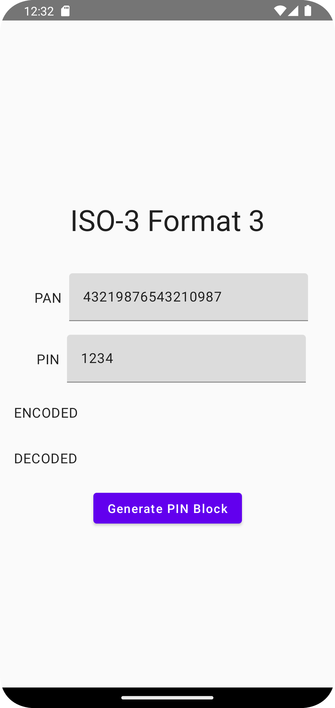
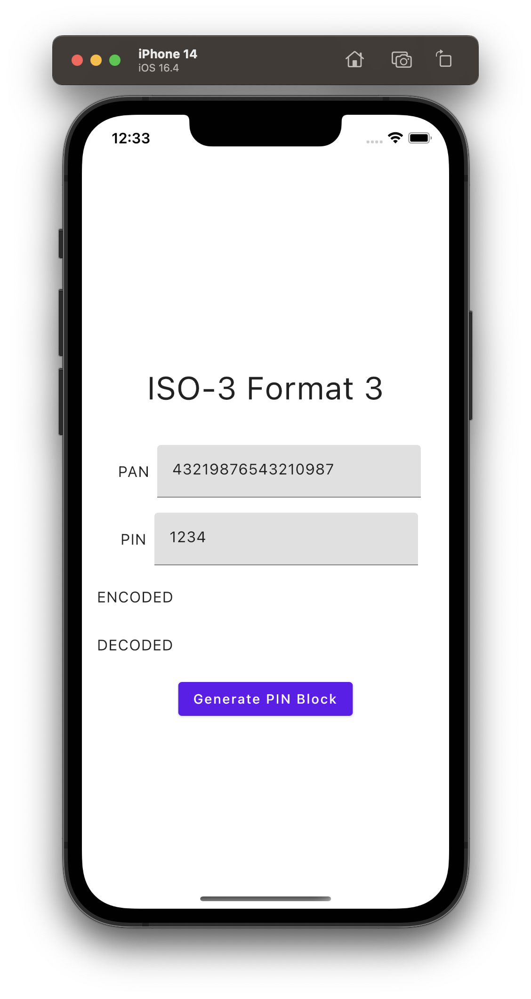

# [Complete list of PIN-blocks](https://www.eftlab.com/knowledge-base/complete-list-of-pin-blocks)

## com.example.common.PinBlock

```
object PinBlock
    enum class Format(var format: String) {
        ISO_0("ISO-0 (Format 0)"),
        ISO_1("ISO-1 (Format 1)"),
        ISO_2("ISO-2 (Format 2)"),
        ISO_3("ISO-2 (Format 3)")
    }

    @JvmStatic
    @Throws(IllegalArgumentException::class)
    fun encode(format: Format, pan: String, pin: String): String {
        ...
    }

    /**
     * Encode the pin block
     * @param format PIN block format
     * @param pan the primary account number in byte array
     * @param panSize the PAN nibble size
     * @param pin the personal identification number in byte array
     * @param pinSize the PIN nibble size
     * @return the encoded pin block in byte array
     */
    @JvmStatic
    @Throws(IllegalArgumentException::class)
    fun encode(format: Format, pan: Array<Byte>, panSize: Int, pin: Array<Byte>, pinSize: Int): Array<Byte> {
        ...
    }

    /**
     * Decode the encoded pin block
     * @param format PIN block format
     * @param pan the primary account number in string
     * @param encodedPin the personal identification number in string
     * @return the decoded pin in string
     */
    @JvmStatic
    @Throws(IllegalArgumentException::class)
    fun decode(format: Format, pan: String, encodedPin: String): String {
        ...
    }

    /**
     * Decode the encoded pin block
     * @param format PIN block format
     * @param pan the primary account number in byte array
     * @param panSize the PAN nibble size
     * @param encodedPin the personal identification number in byte array
     * @return the decoded pin in byte array
     */
    @JvmStatic
    @Throws(IllegalArgumentException::class)
    fun decode(format: Format, pan: Array<Byte>, panSize: Int, encodedPin: Array<Byte>): Array<Byte> {
        ...
    }
}
```

## Screenshot

### On Android

   

### On iOS

   
